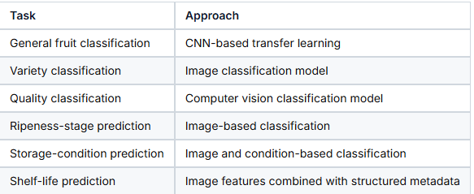
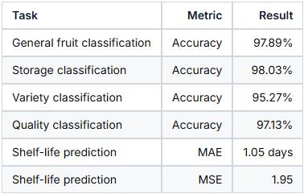

# AI-fruit-inspection-pipeline

End-to-end computer vision and decision-support pipeline for automated fruit inspection, quality assessment, storage recommendation, ripeness estimation, and shelf-life prediction.

This project was developed as an industry-oriented AI system for improving fruit handling and inspection workflows in warehouse operations. It combines deep learning, image classification, metadata-based prediction, and modular pipeline orchestration to support faster and more consistent operational decisions.

## Project Summary

Manual fruit inspection in warehouse and logistics environments is often time-consuming, subjective, and dependent on operator experience. This project explores how computer vision and machine learning can support automated inspection by analyzing fruit images and relevant storage metadata.

The system is designed to process a fruit image and generate multiple outputs, including:

- fruit category
- fruit variety
- quality condition
- ripeness stage
- recommended storage condition
- estimated remaining shelf life

The project demonstrates how applied AI can be connected with real operational decision-making rather than being limited to isolated model training.

## Key Features

- General fruit classification using transfer learning
- Variety classification for selected fruit categories
- Visual quality assessment
- Ripeness-stage classification
- Storage-condition recommendation
- Shelf-life prediction using image and metadata features
- Modular Python pipeline for multi-step inference
- Business-oriented decision-support output

## Business Problem

Fruit warehouses and logistics centres handle large volumes of produce that must be inspected, sorted, stored, and moved efficiently. Incorrect quality assessment or storage decisions can lead to:

- increased food waste
- inconsistent product quality
- delayed warehouse decisions
- higher dependency on manual inspection
- reduced process reliability

This project addresses the problem by developing an AI-assisted inspection pipeline that supports consistent and data-driven decisions.


## Solution Overview

The system follows a modular pipeline architecture. A fruit image is passed through several prediction modules. Each module focuses on a specific task, and the final pipeline combines the outputs into a structured inspection result.

### Pipeline Tasks

1. **Fruit Classification**  
   Identifies the general fruit type from the uploaded image.

2. **Variety Classification**  
   Predicts the fruit variety where applicable.

3. **Quality Assessment**  
   Classifies the visible quality condition of the fruit.

4. **Ripeness Stage Prediction**  
   Estimates the ripeness stage based on visual features.

5. **Storage Condition Recommendation**  
   Predicts the suitable storage condition for the fruit.

6. **Shelf-Life Prediction**  
   Estimates the remaining shelf life using image information and metadata such as storage temperature, humidity, day, and ripeness stage.

## Architecture

```text
Input Fruit Image
       |
       v
Image Preprocessing
       |
       v
+-------------------------------+
|   AI Fruit Inspection Pipeline |
+-------------------------------+
       |
       +--> General Fruit Classification
       |
       +--> Variety Classification
       |
       +--> Quality Classification
       |
       +--> Ripeness Stage Prediction
       |
       +--> Storage Condition Prediction
       |
       +--> Shelf-Life Prediction
              |
              +--> Image Features
              +--> Metadata Features
                    - day
                    - storage temperature
                    - storage humidity
                    - ripeness stage
       |
       v
Structured Inspection Result.


## Example Output
{
  "fruit_type": "Banana",
  "variety": "Cavendish",
  "quality_status": "Good",
  "ripeness_stage": "Mature",
  "recommended_storage": "Cool Storage",
  "estimated_shelf_life_days": 5.8,
  "confidence_scores": {
    "fruit_type": 0.97,
    "variety": 0.94,
    "quality_status": 0.96,
    "ripeness_stage": 0.91,
    "recommended_storage": 0.93
  }
}
```

## Tech Stack
- Python
- TensorFlow / Keras
- NumPy
- Pandas
- scikit-learn
- OpenCV
- Pillow
- Matplotlib
- Transfer Learning
- Computer Vision
- Metadata-based prediction

## Machine Learning Approach
This project uses transfer learning and modular model design to solve multiple related inspection tasks. The project focuses not only on model accuracy but also on building a practical and understandable pipeline that can support real operational workflows.


## Results Summary


## Project Highlights
This project demonstrates:
- applied computer vision for a real-world inspection problem
- modular ML pipeline design
- image and metadata fusion
- transfer learning with deep neural networks
- practical business problem framing
- structured output generation for decision support
- experience connecting engineering workflows with AI systems

## Engineering and Product Perspective
The project was designed with an engineering and product-oriented mindset. Instead of only training isolated models, the focus was on building a system that answers practical operational questions:
- What fruit is this?
- What variety is it?
- Is the quality acceptable?
- How ripe is it?
- How should it be stored?
- How long is it likely to remain usable?

This makes the project relevant for roles involving:
- Applied AI
- Computer Vision
- ML Engineering
- Technical Product Management
- Industrial AI
- Automotive and manufacturing-oriented AI systems
- Process optimization
- Data-driven decision support

## Limitations
The current version is a prototype and has some limitations:
- Model performance depends on image quality and dataset diversity.
- Shelf-life prediction depends on the quality of metadata.
- Real-world deployment would require larger validation datasets.
- Additional testing would be needed under different lighting and warehouse conditions.
- Public repository version excludes confidential data and restricted internal artifacts.

## Future Improvements
Planned or possible improvements include:
- building a single multi-head neural network for all prediction tasks
- adding a Streamlit or FastAPI demo interface
- adding Docker support for easier deployment
- improving dataset versioning
- adding automated model evaluation reports
- adding unit tests for preprocessing and inference modules
- integrating explainability methods such as Grad-CAM
- creating a lightweight dashboard for warehouse decision support
- improving monitoring for model drift and prediction confidence

## Confidentiality Note
This repository is a public version of an industry-oriented AI project. Confidential company data, internal documents, private datasets, proprietary images, and restricted deployment artifacts are intentionally excluded. The repository focuses on the system architecture, methodology, modular code structure, and public-safe project presentation.

## About the Author
I am a mechanical, mechatronics and automotive Engineering professional based in Germany with experience in project management, product-oriented technical work, and applied AI.
My interests include:
- applied machine learning
- computer vision
- industrial AI systems
- automotive and manufacturing technologies
- product management for technical systems
- AI-assisted process optimization
This project reflects my interest in connecting engineering workflows with practical AI solutions.

## Example Output

## Example Output

## Example Output

## Example Output
